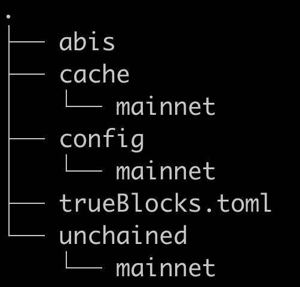

They have to remove all blooms and final portions greater than 0139*

rm -f blooms/0139*
rm -f finalized/0139*
rm -f blooms/014*
rm -f finalized/014*
rm -f maps/ staging/ ripe/ unripe/

NEW
013399654-013400000	QmZacUUYQUxs8eDLLEZKHVQzWeNDe6xhuwajep7dfsr3Cb	QmVcF6ukWbzPGTbjarXH9yGXrVBdY6fHXQuVyZ5RjdVWeF
013396945-013399653	QmVAp5cjv4hfCMcmdeo5KU5EzGLsaycPq3RuUo2kdm5diT	QmaMMoSmaDXqkQNtv2N8SipdFDZJsVbNmsxou61RbzjRgU
013393990-013396944	QmRXG9AbrgZf5cvX33W2wgLyNKiFDNoPbS834nGzV1izhX	QmXFu7xEaJ9mf4uWmDV7gHH5zJgLzJ6JXmXGmKzomBkUSR
013390968-013393989	QmbtHCjuPATVe6TsqEXAGPspxiJcx8bMg6bkkRsTfFXnfq	QmNUfZA2XmhK1SKstQSV4HnV7yJKy6bwn3VrrcTvRJavmC
013388172-013390967	QmRBz7jhXaGEW6h3jfk6Eevdc7NQfFPQ15L97XKXvX5uit	QmaiW3LuJM6iiW93pruViJWQcaEKW3TY2DXirGqJg2WSMc
013385353-013388171	QmPzYgwhkUEhRZ31VvA2McPxY6dDQDiKCui6S11mRZjS1x	Qmf8RRHP5AmX25pqAk1MKNpisqPv858MaHgSW62g1pToJw
013382655-013385352	QmcXPvZMUq58sp83mwd4RjTXub7ivNi18SCFkUE6PS7BeK	QmRa4vXU2WqtPx2sxS5nPRuwSbEmU5WJ5cam8CwgYkWqHG
013379758-013382654	QmahGHaSZ3opQecWXFh6udTEcTbEyRwqm2B2SUnYMwzBbd	QmdSoPTTe4KknotBJVcVTtyuYrnCLLbpgbmnJbQeuTG2Vs
013377006-013379757	QmR65PRbGsw9zXKmwG5njZJe1SjcV5iJUgarap8doQTWPe	QmTQRyvHqW8f1w4GhK2Np3cVnB83hKtG2ijj4K8znoXkX7
013374397-013377005	QmQ6CarHkU1ZZ3y6sssw33DFpA4oSF6pNfQYWeZXyPRKpe	QmZMW8fgs1AbM8v3vJdy62eFmTbTfSqkx3ztHwdWhuQ33K
013371783-013374396	Qmagf36cK3vUWJB711eWyepo5iP6EJWBuC3gcVD1ipLyeM	QmQrXb9kXugHew4FqnbWLZ6DaPCdgzjcJ5pd2Hy8DGL4JW
013369176-013371782	QmPm7dh67kRKP86BQ7PetMUkCS3aWcLzC1bpxE5whSwzTZ	QmSKQqwohGTeyd72yWvm1M3q1Z5x4Mo6XGmaPpCp6juhtv
013366632-013369175	QmYvEjm7vL5D6SXsyWtV1Lzi3Djzoum8ms4hoHwjbu3gpV	QmT4gHRCwhnxovwgGXEy9YfJQiWav1XMLo9iBwhm2RD8FJ
013363972-013366631	QmcsCRbDbv5g1Th9Z1JK8ZQiBZ88hhfkAKbM6RQjYiShpm	QmQVpvS6utWEunhVMs7gULGMdbvtFYQ3vertLc3WBJqCiv
013361131-013363971	QmamZxBg31GGpPvuaW3vL1hCyCi6a2RKetMr6aQaiJbN2q	QmWfFN3xwvbfEDztoDR3Aq13dq7grqq5rxg3n3YKchmyPg
013358444-013361130	QmNiGH5eSRFgEcGYCdSJ6ooAfFbdau7iBASuW74WjrqNDQ	QmTvysDBhGfSiPRbT7ADWf3Kpgnv83TSAvApPmr1gr38gw
013355737-013358443	QmR1HYjCkLooiL2DMaJAtGscywTa4rv4HJo4vSAM1HzpGE	QmPuSwt5W9AzeXnfW7EyzbFAyqAUr41cdECr6rrjRsu9hJ
013352850-013355736	QmSgo8GcqHDdjBVzWesLErVHTK795hLxgvzsimJ5qNPvJo	QmZh9X7LW5JxZA8GkCmbnTupyMug61P6V2AEW39JbDsPfy
013350038-013352849	QmW61NmJs91oKrYA2HpWwMScq4yaY5mtRwQa4cuJAtiuYy	QmRfqYnTXjBtSmjPaKrSTieFi5RVhCUTVUPSMy9wAtRrG4
013347147-013350037	QmTJD5vVgpx3ezWq2MUvoLaZuJBCVqL6wNxNSy959YSx6v	QmZC7Vamy5tVbDBqMuowLWQ1cXyLsTTywtBHhzCHwQ9vD8
013344402-013347146	Qma1hKiMR7NvicBnGSuykkrrwZDGQmZVndBBeDnGLEV22y	QmTuXRo174TD9mTEZsgagiCFLSpT8DhL5rAMc9XEYuiaRa
013341516-013344401	QmP9kzHgkDef8BcXCF2c2gPF1vUY1vXkjx1zSuEDJMeFZL	QmaKd9cdtQHZjy9SicdLUvFowCgpUhQDC7gqP8Rubs6d9e
013338675-013341515	QmbxGgZ6iMyVyoSYUtgPqCHKWZsfquj9Ac5NoeQtP7JVBH	QmcJhkYui2dLerfw15DivWBw6kk2mtKXbt2Q9yWaF2fg25
013335785-013338674	QmcpLQC1D6MLmmiv635UsUB9qdWRPwMFTkeSaPZM6aBkaL	QmVy9qz5XeV8Uvns22kHmwEmDrR6KPZdigZn4gRaLsv3hw
013333028-013335784	QmTEBRDjUZvB3BnGfcfZvCqZAh6v6FKnPmPYuUdcM2AGZT	QmePtyBzyQFxBEmqGR49GGWzsEMnJLEWqPsvGgtbFE3By7
013330223-013333027	QmXcMeCtgh8rmk4oxVJpN7jTpt5kvPxX2QE3S9YSdyisS2	QmXxmkaDAyozL986rRaCBzV2tfjXLdJtSfNxtEy16NgWmF
013327204-013330222	QmYnLz359UhAJSJnFrrFY7eDUbTuRLLResKebUiCBRQ3AW	QmRnmCw4Qbe5ApYpgpLmHqRqRQRcFqm2R4qnkBkmt8yt5y
013324346-013327203	QmVz5KqX4ZmBDpRsJ2Rnnv3Mos4zcYhN4r5GSLnrageJS7	QmSYKxWq5qdYeJCjRcQy477bM6grH7t76Mxp6ha5nAs1vu
013321454-013324345	QmP1bP3LsNtQGJasb4QRzhXTTqycwMAhdaMCMX4yyACHnk	QmY4r9BNVZfJMeTp15XTJ8g1qimtSY2mU74EbD3afpUKNj
013308630-013321453	QmZhH41Me8fKU2bRJy9rgmYqbzLA8zBzDodpheaSURL3T9	QmRuhTqtcKjhJZf2FXmWKPEHaDtrCLeR2SouLpyndCag8b

OLD
013398621-013400000	QmUddgAr3zeWcTxMwgcmM7JtSDzmGNGK3bjnbbDgUPRcJw	QmdSNRswrn5mvZM9DNPB8JwDHdz9GK8C8FUL2cDiio2xyR
013395808-013398620	QmdeMU2hSZpHA2ZqrH24Z73NSNCcWFKgo4GZTpP8eQVFGf	QmfBVvmi9F7pq2juriRh3U3gG7Dn8qyUrWygWZWxd4iDH7
013392801-013395807	QmSv62ZaPC6qb9dyLL5kchxGoXNQAtsewxWfmKvnnxXZg7	QmcYv2njuPuft1SygK92W75o3pY1S1oJK6CyYaTBf2AeSU
013389875-013392800	QmcHHd22HsXcZrTPpbVWwqt5T4xzadDbgG5vTJsiznZwnd	QmfEegdFporBy92UdBq7HnGHbsKAFAaPUYXK9NSFyuPtcT
013387069-013389874	QmQqoA8yfmZGBC5wcSZ9LoFNExgzKpPVKWZ2QY7YhjpGtL	QmQdjoBEeViyeAZmnjf2KraNzYyLHcHa5JSFRejL1jvMZK
013384284-013387068	QmbPVkk2CCM2QxAyT9PAmmNDntC37CgPvcPjowD5sRmz25	QmcyRbbhrQvjcFF6GSdis9RHg5NcJqrVmTojU8g78xbi5N
013381508-013384283	QmZjvjX47ZZhGSseSoezpQdKxSo1Nc1BVsresPFkrMqyXG	Qmc25KNYzmnHPg4SXtnkpBRFBLYtsBtkU3YbYZ2trNADf8
013378544-013381507	QmWLd7cPkKgeQUsJLHHcUf6B3JxYwankDDxjnfyGpAY71s	QmcjjtbBLoYDK3q96K3r9i7wvfx8ga65N9NyH3KEYwCFLj
013375939-013378543	QmXfdDoD1ZkeSm1oSRmFtjTGmM3J3CMswxQJ6tUwyGVdvU	QmVJysuJWp2yUiWGZxnoycGTFZtY7gyos72t4d2a7gQnyu
013373320-013375938	QmRRFY7V74vhVcKMCeHZ9GkZkWMhNifdMkn5wwt6uePeHV	Qmd6QUnTX7hcDvBq2qNVJ6qyEXrBVm1ocnHvmpftqWuin3
013370750-013373319	QmPpkWjT5LiEQ5eKfcGPjRKnACsvphWMcK9AZAi2Jz2jAJ	QmZfApudGqEb9m9ZCP2foRGyK6rEs38W7CQuGY1MT5t6MM
013368174-013370749	QmVrvrHtN4f8xtN8VRTsEDSdQQvdhLLf9HhXKNd35vi7cn	QmSWZGQKp6rxxm43rVzEAuvYtcXyHG9JYBrnTdmBGpTgV4
013365646-013368173	QmYtDvrZ295DBf2KnzooGt2Yka6JkuaETWQKXVn2k9o8Ez	QmYogCKW5oMYBPRi27VnXW7rbwWVP7fZwieQ7mqUfMRYjd
013362779-013365645	QmUMnkpkdWCRiGqGSoXQLNNyG2kDpk1ZfD7LW7WgtNMLe5	QmUfG2HMxGAfs6WWvhrQithDk2VGght9qqpvKQn398EkdL
013360052-013362778	QmX9W5Wugr9Gxbqr1eLerwzppnHmdL6szQKWpvkh4yt2b7	QmNxU3cBSXfaHHqN3v54Pryr1tUXZozvvE12fNqA269KVw
013357342-013360051	QmP3acsYbBxGAdNj4mFMd9MQhGvdGDHBNxFAq8XqnQcgnF	QmQbHeAoeGqTTHaYLAR4d1yTsVaVpXdNubrvJLwVMD3Mkk
013354617-013357341	QmcYfJHPkj29cBvDu7M7ECfv7qvLU5XwnM5PLkpiiF7NYc	QmPyo5GhkgbkpNpjMiehc2Z7enfptiSx5vD5cjfa4U1cbN
013351761-013354616	QmbqfFq1gh8yD4BDQGhXK27sEPRFTvFeBr4JZVUDD2k1Db	QmVqVVMZ4Er7tLRV3ofLaJwtAxTA7Bw4XynByZDKpUkf8N
013348862-013351760	QmbN4GTKxMKo26P1VDgA1WBHGDaQQv67JsRJoM4YLe7wte	Qme3qzPPTLSPK1xyjRoZaSnDkXokWLmxn5qz88XSNJbcj3
013346064-013348861	QmWz6VhPYVCidcBL9aAjWTRBLF1KvHPSEHVYTEn1f6V9Gr	QmR3brpYQBSkjHkkUiKeRqYWuvL1ENP4rV6H976iypASh4
013343306-013346063	QmPmaiD8Jbat3GHUCrf3r2s3EQ8ZxPywDPtSyQLpActrEw	QmUcuW3kDE5KwEEZLenE1CTWb8GtmtGo3PTtENf3z6iVQi
013340419-013343305	Qmaz9S4ckqxP2BNJAz13BMj1uZ1itsaLo7pCLtW8KwPDxZ	QmfHFg4mUtaH8ymzu1TbL3kQv2WkoietAEUpwbsaLzs4KH
013337527-013340418	QmNMXWZZZDx1jNqV2SzfR7xbxP5kptHcojix48eT83inc1	QmXp8H1FmVSc4Yd7xPvJpe8Zmm6LxJTmVgDrthLsAVRSY9
013334654-013337526	QmZLMmgBxQTBCSMeuveViU15nh3YhXoYaryX7RZ36QiUPR	QmYnDRTpFJep4AqYxWVeL1FcNMwjxKzNZ1JiZLVH7spxHC
013331978-013334653	Qmb9be63gnZiUjoEa6pdW7zcxxxzWFRNGDh2M78pxMy93y	QmNyFg7oAA3qh2Cy4jxTZWXAvkaCSJrBj1SMGKfKAYvPk6
013328911-013331977	QmQ55sMCderzjnJQr9utFMJ1c5Di161BM66gUPKJt8jewB	QmTVjqzZnAioFemisM9SG2g9Wihwv9cSHfzHdFvgwK37ag
013326058-013328910	QmeyKQKiEdUpcPaEUTP6vsT3H4QdAuzWhd6gpTa3mrMotF	QmTDFSbcPbtQXtPRs8YoVvqvCHZQaTkP1dZKSAXKW5CWt1
013323255-013326057	QmYBqaeLTq1JYEsGkWtZmNh2ZaaC9cjKJqe9pmuQtDhbcc	Qmdnn9mUEZSBps8K8kkAEJ7HiM4qFwRppyLpkJTddce2MU
013320355-013323254	QmYLcU9qUpLhETffC4X2MjtKkFZRDn85XXBgGTMT2sWhv1	QmZqZ2ZUZ3s8tHBm34dGWyXpr5ShZgkHpTKg1n79NpehSJ
013317545-013320354	QmRxGboQht2ST1NMwkWdytsF1nL5FVrgfEhZ4ozBU1UZQU	QmQP9oKDZrqBDXMXCJS5UjWhtp8viDuAJqy3t2ERgFs6X7
013314548-013317544	QmXFzVi2TE2iR2ALeJVfGe7ZFgeDgjW3UeHiAussgFvQoX	QmZbT4zLcp8WTM6MH33D1nVP4eRCDwGTk2L37rud2c1bgK
013311678-013314547	QmaBmWyq4KdiuMrrErxgniduejueqQi497DzVfvzdR3Ft8	QmP72KErK2Z6rbpQ8tHjTtTqUrMEEimaBtk9vzxunKErJc
013308630-013311677	QmYHyegTZYecms9P9gCuNUp1vBZ7XHQohswt8iqmdmNhCe	QmP81iaNY88aHYaFrJPST1cT8gD76q3ZtnCHBk1YJA4dM6

NEW
013998614-014000000	QmWkDvCFQNXQsjXC6MG3KKvUFHbbwLtjrctgvDEBg71PhD	QmabDZbTXVr8eFvyjYRwJSP33xKZKDn8qj8iSJBHGoULB3
013995952-013998613	QmWYGdCPXbbh8YNrgWXH1CTxWH33nANcDHnfQC3AHDHta7	Qmeggo8JogqGPDHrvW6D1Fo7T8rstfiTStj8WewA6Lqdm1
013993198-013995951	QmXtaxg9E8fW2DLPvJvwUxwiC2T6kSNyMLwVNWwDT2B9cx	QmUquko1DyoPqxfS7GNKL4EpnHxzvT4ksPRmsU7wvqRHc2
013990425-013993197	QmVGbv7m49AyVPqGiAtKbGAgS4wiXFUQ1BSr3M48VptN52	QmeUd829yXJCGd6z4ya2p2ovEVrdPvGmp56VTqujECKQo5
013987699-013990424	QmaZf3LQCVjdkzGvifVhF7W4Ja62YU9ngUgdzbMDHiypJa	QmPeNaQKnabSDkJKHca6EpcY1X8UzKMs12VVaGNDEeMRMd
013985020-013987698	QmTgeYsTqREFRJboaYe1EZiEGCAFzD4JTmoqLrrb5Ui2Rc	QmZHNUBeXEhApXbBrTS2PgWzTnbUxzGgKzycckKyz6omju

OLD
013998615-014000000	QmY1ZubV8JpCzgJs8SF8zAatmCMt5w12eNocbodxMATWZm	QmTEevEuHWwxe19npcpaPFNr3aby2xWpReksDb2cMwnrsN
013995953-013998614	QmbNR4jNCBYy1NoE7r1Qi5rJLpNbfw2tzjHKnN56Y7rd5H	QmfNSQZXpgpMX9Vat1drQbA79kSdaeiFVXB78k3ZdTptiH
013993200-013995952	QmPYC3WVvco1qa2PQX97i5c4dYEXJvxEWczxTZu917T5Xw	QmeQri9zbinqJPrZjckT1vwJ1uRVKCxrDsnideLsZPcTfU
013990428-013993199	QmXMtgRKHdjz3fhsUbVLXE1EEUrkRDfLE3rCoDDB8p3UKr	QmPrRGT3txMdKmDiMSrehSVbf4Dy5FyMQfjwGmEy72pg3F
013987703-013990427	Qmf6dpYPS35smdusQ6VwxyxCZ2jAB49GonZCNBoZea99jT	QmdvkodzTycwNJdbgNLuRhLxku4M49C3nKrioJE3GB2CT8
013985020-013987702	QmPEAPx15JqAxEhAJnCunxJXMRRRMvLFh5fweTLeaQE2mR	QmThknFMVpyvbaBTvaXCgkS8f6ofErLnHiNRPtz2EZnsXG

NEW
014198567-014200000	QmVZDLfrSMJKj3xrJrNMRvYbseUaDYjdMRz4U9cv5fvW39	QmSgDX8GXjNr12QmAQkPnDkAeVbw5RNQVbZDDPU5aj9oja
014195592-014198566	QmZAnjLXnP6n5BSo3ypXXPCiioo51V7PhFfWDhRVsPd9yE	QmYb7pVkRvLghTANkwACjyxyg4EDvpiQBu48Nn6m2pUgfb
014192528-014195591	QmUrG4aX282dmW3UzmeZdQVd1Q1F9WuuGVpu38UA4of8QN	QmV3Eurw4NhzLiwe1EQ8ccHepytSZqLqk6npGkZSZs7qVH
014189595-014192527	QmPCiRxzT1EVZ5eAEKbbM7u8S9z9HHAjxvn292w2Bosdei	QmdKnyKig52UZivHbAP6BySvjUKNnfZUcfaVREocYGzsUy
014186760-014189594	Qme8TPeiZ41VoLFmQPAmeTnz3BbY7YVkcWydjq6mPLimHN	QmdnFNVc1ww5uMcqywo1FhD82L2b8WNU4TMFgASLgDNVYA
014183985-014186759	QmVCV8xpsrhMjspCBkjDnr1vZKUyeyfzd7fLFAbMCPnmdF	QmS5UtwM5oxVzAkBNgoSjndDviMZGQhAZwYDWSSjjKjF57
014181198-014183984	QmQf8Ku75LDAvHmUrr1T7SW6fnbcYCTmYdZ5k15aqyUjMq	QmWHwA6cYPjLW48rkKYSkQNbo58rS1RJXU2v7H4RMgbxmR
014178453-014181197	QmPLrkF9tWkJcgPLdokmdPkcKyk6TTyyj6wEg31ECX4E2S	QmTNyDAzKmEu6H67enrY7ezSsqQXAAL5pThknncCGmdYup
014175635-014178452	QmUJJTuXLmEErRoVP4MvvvsZYJumfDY2mwCRXE3hHnnqMc	QmXtu9dTc2jJyWiHK9WzpFDpkdy9bFnEDVEszjHXbqkp9z
014172898-014175634	Qma3NWgP6jgvEznzmbjhRPgVSyUVqYhj9AaFG48pJ32ekh	QmZhoNj23bikAcfMabCLhmsN8r3WQ9rrCtCA1p64JsezV5
014170047-014172897	QmSJPvRyHkxvcmjPc15fGoR8KFZttwqKkdPswuu4y4brSa	QmWZ8G1Pxsr9vTNfNYYw7oSJ1bhgA2U5ajyNV2VcKjbmRh
014167120-014170046	QmcdTjUHzdtZEbRFRrFcRMTFwUZ7PHErTsGuYeyBhKKAjy	QmTX5otirm8wmAD1zbZnjT5G2orFnAnTu7vLCYyBemNhdu
014164261-014167119	QmNxccrvcq9wWxvZ7HbmgeCzg9Q42W1gSm6D6QiRabJmSF	QmSrQPqhzFdkiwwf4ngxnct7m5hEB8dLSUgBawG7rCCXbG
014161425-014164260	QmdSdLZndpmAstL9E7G9sQpfVeeb3Cqaik2tvVodEjpYx1	QmPUMf3WLf7FwJ369THtFAJ9HDNVEKKFeDKfE7i5PkoNQn
014158542-014161424	QmUeNLc56R2XJvc8FmHb58sLqNc62dni9C6aLZw9uFZ5oH	QmTHJe15Sm1CEtA95BW48YHgzo9154Dq8Voct7iNShwMVm
014155581-014158541	QmU72kZB7tb8Rx9rjJ6kzq4GFW5BuyoLKEffs6MLKBHD5p	QmervGkKQBr1B8H8GfV2STUgxp43bMG4BTBFNTN4pf6hPo
014152618-014155580	QmVVyefX7TwhtXi4TpaZYkNj8a6cmiroir2MkoySZ2bduE	QmVX4K8HarW26P28e4QMnFuiTtzzs1avVuSzqTNz71XUDN
014149595-014152617	QmVYzt8XMkZXfLuM1PjR1kEwNSbHcYbwV467EoAgZTayBp	QmYeZ3z4mXu8CDRuHTF5Za9MQ9teW6QcA926S4UxNZS4ex
014146687-014149594	QmdPzGDB3xQDvY7BBK2cYL6hXwcn1LRcXNkZFQnwNh1Erk	QmVgb4ybq1AnGcBoTjYhCegWaH7WBEvcVQ5pZuixQ8Duk5
014143891-014146686	QmdDSKh972o4dLuTgSzLhqtFq4EAd9YkTxFjxoY8qcAcSq	QmPnKxDyBzou7gFDZwzZXQAxWRjzHobGtUUvPJEffQUDZn
014140958-014143890	QmZdBquNVTEgPx3KKJqrYTAiLpTbG8JUu8WXL8VQ18KhjX	QmURijjpoqNmbSJbCkNvXHpYdtKCtgSCbs66StdNxKQUaC

OLD
014198568-014200000	Qmc2EEoB7U5njG9jjTcLLgiWwAMsb7hRtSVEryzvtRpsZv	QmdZSnYnBM88unW1kX7ZCvJAWcHinaAFvQdRnwVPqHXawH
014195596-014198567	QmUxtt9faELW55QQ5Xi8VPe1K1jixmi3ecAmXKQSpL6e6L	QmT2fhkZ8g9Vzhv17xiTfaFwzMRG66J83JwqJtsBvUDVgg
014192529-014195595	QmZErc5Uuk54wqmRQsip46KYyUzZUg9pagzQAXzPVzgvtp	QmW6j1yNWvmF6oYK9iCDhZASJ8Jx7a7gXwRiu1Mezk8eL8
014189596-014192528	QmYSgFGzSyXZ4bN2FY48wzm4nMS3CCELwm2w7E4pK9MB9E	QmabemKgTDNSpM5A4ce8EqXbcmhPSRkk7dXXtWAQVCuUzF
014186762-014189595	QmU2fAWWprhtiHD4uFoJWeEpFVnkX6ybuKDEP3qu5k37m1	Qmab3rD6piAaXsXqDjLeHUijDrNMVi5RixgBfp8aN5npQL
014183989-014186761	QmXQpG7TZNDMPSzqENGMSina9PriMbFVop6BwKnAVxooN7	QmNSUikfKwfQhxehzSZDy7AkzCiVjUXRQT23gh8xvNneJH
014181204-014183988	QmPF6c3UT3PmmsEqqHCtR64fv3BPuqNDxHnnzY8RVgVrdt	Qmdo3V17tsX82W97mvbrAKLywTFxo3i7ouuuWLHT5Lmj9R
014178458-014181203	QmSdJt2ecoLjmArB45fxRnsYerMzBGfAFiYKFc1MEu3jCN	QmeWGpiyuYUPKK4d2CcUh4irbR8CD4vrHjubmaF8PQ2279
014175638-014178457	QmSf4GxHiFFWRjirMxuRc8vmPWUXnKuuh7imYBFf29XqSF	QmYTmVYpSCGUjERCEFHNBxmswcRmRAenrz4g67Ccsp4RP9
014172904-014175637	Qmf8UfHmZ4XhvJVDZj6nMVyWimpaC3zHmoudRcVDRXvCN1	QmQUHBVsN4UnWq9rcbo93aYUZPfQdM3BBWZkiw9aRkYdBr
014170054-014172903	QmbemVpHxAy4RVfGansZp25nQoYduL1QQMTfCCnhNV79cB	QmPCXAt26sfS51tbRsvNadAKpdjjAZ4YERJNu44tLLbZNd
014167126-014170053	QmPJ9yaHoa7ks3v1xQh58hHU98Y3aftchudCGXk6Ybb978	QmSHi95swafChz2ChQunYjW6VfbtBkz1ABbAfUfGmuH171
014164266-014167125	QmTsc1f7DFsLp6LnXfBviHi3TPQcC8n1R2eego4EpqsY8t	QmQuJaNXcFa7NyrL4nnAcJVYpKSq9Ag1RG7MdE8oW75SLh
014161431-014164265	QmSd7mjvMAyi2cn1Zm4dGDEmnaxJrJBmU8nDyz61HiT51e	QmcsKXGFFiQ7Afb24XjchmrSeen1paKHQDDXqu9E2Q5jQB
014158549-014161430	QmYJKUM1sAeYqDwCrV8XsAHjjMJpnD7dZNPiAeadAm47sF	Qmc2wzmzyxbV8v8hvsN2BnK1foJjfbu6UjfQ4Cy7caMAaK
014155589-014158548	QmbVTMgXPDHVkRUq6qV9ytJcWeQmN6vZWsZdaVXvQxpw34	QmUDGWPQ2tvrrG14QaHrWxAZCKiFzpTRxLRjo5XHJmcfag
014152627-014155588	QmVGzRhG9L1GnLTr1PMTWxpW71JPRjEC4RAwDASx5tT7yW	QmRF39whwTGaCPx8CUiHPRZYwRiu5XNHD4ANj8x919t8Pa
014149602-014152626	QmajoAEKZnJQqADkUcKC61p1Pg5wRXZ6yCnirVF924JD8G	QmTZzx9s7wAaYyQM1hWJ15AFjFzB7QhCHC8mWfMzwQGj2E
014146695-014149601	QmdP3ic9Y5x9ESoYFm2Z8YTTP57mF7wELn2fUsZWjKVn67	Qmf2yqWFsznqqCJNnvNygF88H14PxPkUSeZ2p5P86a7euJ
014143898-014146694	QmbHsqynAXNKYZ1a3hv8NX9rX4Mc9zksBX1X5RQYNqirSJ	QmXa2vtrXmzKufwFcTtnYTgdWCwSjXdEqvnWNCwsBFGEUi
014140958-014143897	QmaAipMhsAo4xmDHb4FviBaNbRWfN7Bn28nn61t21hnHVT	QmcK69QTdD76B78kxacpTctRB9wK9bJZDf3XL2NGaWPQCs

# v0.25.0 Multi-chain

---

(February 22, 2022)

## Why the Change?

With this migration, TrueBlocks enters into the world of multi-chain blockchain scraping / indexing.

Under the covers, this was a massive change to our code base. On the surface, it's quite simple: we added the `--chain` option to all commands. We've also pre-configured a few chains for you, but you may add support for any EVM-based chain yourself.

This migration requires you to edit a configuration files and move existing folders to new locations. Be careful, if you make a mistake, you may damage not only your installation of TrueBlocks, but your computer.

Please do not say we didn't warn you.

### What do you need to change?

This migration involves you doing three things. You must

- change the location of two folders (`cache` and `unchained` index),  
- edit a configuration file to point to these new folders,  
- remove or move old configuration files and folders.

## Instructions

In the following instructions, we assume you are working on a Linux installation. If you're on a Mac, adjust the paths as needed. (For Linux, the main configuration path is `$HOME/.local/share/trueblocks`, for Mac, it's `$HOME/Library/Application Support/TrueBlocks`.)

### Before you start

- Stop any long running TrueBlocks processes (such as the `chifra scrape` or `chifra serve`). Do not restart them until the migration is complete.

- Move -- do not copy -- the old `trueBlocks.toml` configuration file. We will need it later.

```
mv $HOME/.local/share/trueblocks/trueBlocks.toml ./trueBlocks.save
```

### Pull and rebuild TrueBlocks

- Pull the latest copy of TrueBlocks, switch to the `develop` branch, and rebuild. If you've previously put the executable files to a non-default location (DavidFS!), remove those old executables.

Complete the following instructions from the root of the `trueblocks-core` repo:

```
cd ./build
git pull
git checkout develop
make clean
cmake ../src
make -j 4
```

The above commands will rebuild the TrueBlocks executables and create the new multi-chain folder structures. These commands will also create a newly formatted `trueBlocks.toml` file (thus the need to move the old one).

### Did the build succeed?

Let's make sure the build worked and that you have the latest version. Run

```
chifra status --terse
```

Unless you're running your Ethereum node at `http://localhost:8545` (the default location), this will return an error message saying the node could not be found. If that happens, see the next set of instructions below.

The above command may report a message saying that you have not completed the migration. If it does, it should also show the following version (or later):

```
chifra version GHC-TrueBlocks//0.25.0-alpha
```

Until you've completed the migration, the migration message will continue to display.

### Editing configuration files

**Important:** Before doing anything else, you must edit a configuration file. Don't run any other `chifra` commands until we're done.

Display the values in the old configuration file you saved earlier:

```
cat ./trueBlocks.save
```

Make note of four values:

```
cachePath = "<cache_path>"
indexPath = "<index_path>"
etherscan_key = "<etherscan_key>"
rpcProvider = "<rpc_provider>"
```

Change the current directory to the TrueBlocks configuration folder:

```
cd $HOME/.local/share/trueblocks
pwd
```

(on Mac, change directory to `$HOME/Library/Application Support/TrueBlocks`).

Edit the `trueBlocks.toml` file you find there and replace the following values with the values you noted above. Note, you may remove the existing `rpcProvider` in this section. We will replace that next. Your `[settings]` section should now look something like this:

```
[settings]
cachePath = "<cache_path>"
indexPath = "<index_path>"
etherscan_key = "<etherscan_key>"
defaultChain = "mainnet"
```

Find the section called `[chains.mainnet]`. You should be able to find an item called `rpcProvider` in that section. Replace that value with the value from your previous installation.

The `[chains.mainnet]` section of your file should look something like this:

```
[chains.mainnet]
apiProvider = "http://localhost:8080"
chainId = "1"
localExplorer = "http://localhost:1234"
pinGateway = "https://ipfs.unchainedindex.io/ipfs/"
remoteExplorer = "https://etherscan.io"
rpcProvider = "<your_rpc_provider>"
symbol = "ETH"
```

If you have values for the rpcProviders for other chains, you may set them now if you wish. Each chain has its own configuration section.

Run `chifra status --terse` again. You should get the same migration message as earlier.

### Moving existing cache and unchained index folders

**Important:** If, in your previous installation, you've customized the location of your `cache` or `unchained` folders, adjust these instructions accordingly to account for those differing locations.
 
Complete the following steps:

- Move the existing cache folders into the chain-specific `mainnet` cache folder:

```
cd $HOME/.local/share/trueblocks/cache
mkdir -p mainnet
mv * mainnet
```

*Note: You will get a warning saying you've tried to move a folder into itself. That's okay.*

- Move existing unchained index folders into the new chain-specific `mainnet` unchained index folder:

```
cd $HOME/.local/share/trueblocks/unchained
mkdir -p mainnet
mv * mainnet
```

*Note: You may get a warning saying you've tried to move a folder into itself. That's okay.*

Run `chifra status --terse` again. You will continue to get the warning message.

### Removing old configuration files

Almost done!

Change back into the root configuration folder:

```
cd $HOME/.local/share/trueblocks/
ls -l
```

You'll notice a few files and folders different than the image below. The last step is to remove these old files and folders. When you're finished, the root of the TrueBlocks configuration folder should look like this:



When you've completed this step, the root configuration folder should contain a single `.toml` file (`trueBlocks.toml`) and four subfolders: `abis`, `config`, `cache`, `unchained`. The `config`, `cache`, and `unchained` subfolders should contain one or more chain-specific sub-folders (no files). There must be at least the chain-specific `mainnet` folder and there may be one or two others for other chains.

**Important:** If you've customized any of TrueBlocks' configuration files other than `trueBlocks.toml`, you may preserve those values before removing the files. You will find (or you may create) fresh copies of the existing configuration files in `$HOME/.local/share/trueblocks/config/mainnet`. Move any settings you've customized in your previous installation to those new files.

**Note:**  You may remove the `[requires]` section from the `blockScrape.toml` file as it is no longer needed.

Continue running `chifra status --terse` until chifra stops complaining. When it does stop complaining, you will be finished. Chifra should tell you what files it needs you to remove until its satisfied.

## Are you finished?

If you've completed the above steps, you should be able to run any of the `chifra` commands. If `chifra` continues to complain, review the above steps and/or contact us in discord for help.

Run `chifra status --terse`.

If the migration is finished, it will return something similar to this:

```
<date-time> Client:       erigon/2021.11.3/linux-amd64/go1.16.3 (archive, tracing)
<date-time> TrueBlocks:   GHC-TrueBlocks//0.25.0-alpha (eskey, no pinkey)
<date-time> Config Path:  $HOME/.local/share/trueblocks/
<date-time> Chain (ids):  mainnet (1,1)
<date-time> Cache Path:   $HOME/.local/share/trueblocks/cache/mainnet/
<date-time> Index Path:   $HOME/.local/share/trueblocks/unchained/mainnet/
<date-time> RPC Provider: http://localhost:8545/
```

Try this: `chifra status --terse --chain gnosis`. Does it work? You're multi-chain!

## Are we finished?

There are a few things that we have not yet completed for the multi-chain work. We are working on these actively, but they do not materially harm any functions. We did not want to delay release.

- `chifra init` and `chifra init -all` routines work only for the Mainnet Ethereum. For all other chains, in order to get the unchained index, you must scrape it yourself. Do so with `chifra scrape indexer`.

- On Mainnet Ethereum, TrueBlocks uses the Uniswap and Maker smart contracts to create a US dollar spot price for Ether and other tokens for all transactions. As these tools are not available on other chains (because they don't exist), we cannot create spot prices on other chains. This applies only to the commands `chifra export --accounting <address>` and `chifra transactions --reconcile...`. Instead of a `spotPrice` TrueBlocks returns a value of 1.0 for all assets on non-Mainnet chains. We welcome any ideas how to work around this limitation.

- For the same reason, support for ENS only works on the Mainnet.

- For all chains other than Mainnet Ethereum, `chifra slurp` does not work. As this tools will be deprecated in the future, this is a permanent state of affairs.

## You're finished!

You may restart the processes you stopped earlier: `chifra scrape` or `chifra serve`.

Please see [the help file](https://trueblocks.io/docs/prologue/multi-chain/) for information on adding your own chains and using the new `--chain` option.

Report any problems by creating an issue.

## Previous Migration

[Click here](./README-v0.18.0.md) for the previous migration.
